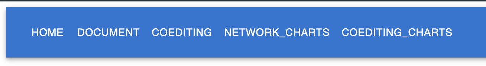
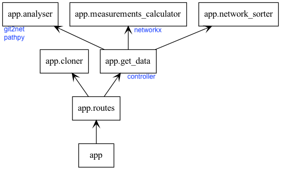

# Github Repo Graph Analyser

## Overview
This project aims to provide an analytical overview of Git repositories. Metrics such as author degree centrality, file degree centrality, and PageRank are computed to offer insights into the development and collaboration within a codebase.

[Project Overleaf Report Link](https://www.overleaf.com/read/tgvbskqdyjbj)

## Getting Started
### Prerequisites

- Python 3.x
- pip
- npm
- React@18

### Installation

Follow these steps to get the project up and running on your local machine.

1. **Clone this repository.**
    ```bash
    git clone https://gitlab2.informatik.uni-wuerzburg.de/s434383/graphanalyzer.git
    ```
    
2. **Navigate into the project directory.**
    ```bash
    cd graphanalyzer/
    ```
   
3. **Install dependencies.**
3.1 ***Virtual Enviroment with the dependencies***
    ```bash
    python3.11 -m venv venv
    ```
      ```bash
    source ./venv/bin/activate
    ```
    ```bash
    pip install -r requirements.txt
    or 
    ./venv/bin/pip install -r ../requirements.txt
    ```

4. **Run the application.**
    - If you're using Flask:
        ```bash
        FLASK_APP=run.py FLASK_ENV=development flask run
        ```
    - If you're using another framework or script, replace `app.py` with the appropriate file name.

Now, you should be able to access the application on `http://127.0.0.1:5000/`.

#### Frontend
For running the frontend project, make sure thet the backedn is working and then follow the steps below:

1. **Navigate into the project directory.**
    ```bash
    cd frontend/
    ```

2. **Install dependencies.**
    ```bash
    npm i
    ```

3. **Run the application.**
    ```bash
    npm start
    ```
Now, you should be able to access the application on `http://127.0.0.1:3000/`.
## Performance Metrics

- **Backend**: Typically takes around 2 minutes to analyze a medium-sized repository.
- **Frontend**: By hovering on each node, you will see these metrics according to the related node.

## API Endpoints
- **POST `/mine_repo`**: Accepts a Git repository URL, clones it, and returns various metrics.
- **POST `/mine_repo_with_date`**: Similar to `/mine_repo` but allows for a date range specification.
## Tabs on Frontend
For each of the provided endpoints, we have seperate tabs on frontend. 



## API Documentation

This API documentation provides details on how to use the two main endpoints for cloning and analyzing Git repositories.
https://documenter.getpostman.com/view/21593327/2s9Y5YRhfB

## Backend Architecture


## Future Work

- Backend: Add real-time analysis and more metrics.
- Frontend: Add moer complex graph visualization on different tabs.
## Authors

- [Mamad](mailto:seyedmohammad.farrahi@stud-mail.uni-wuerzburg.de)
- [Nada](mailto:nada.aboudeshish@stud-mail.uni-wuerzburg.de)
- [Kimia](mailto:mk.ghassemi97@gmail.com) 
- [Anatol](mailto:anatol.wegner@uni-wuerzburg.de)
- [Lisi](mailto:maryam.ghassemi@stud-mail.uni-wuerzburg.de)

## Links

- [git2net documentation](https://github.com/gotec/git2net)
- [NetworkX documentation](https://networkx.org/)

